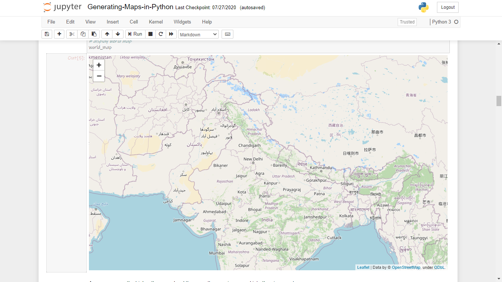
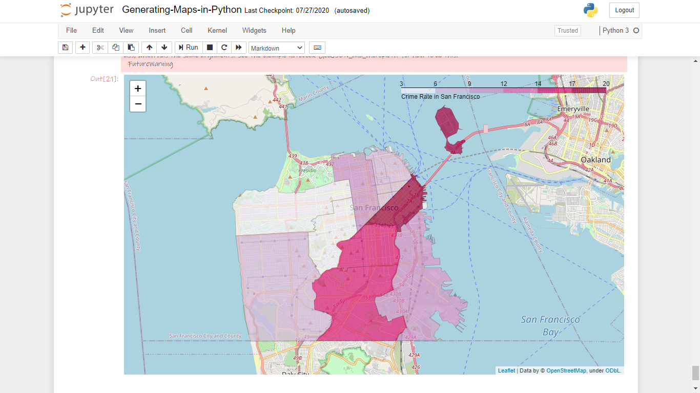

# Generating_Maps_in_Python

P.S. The notebook is not opening properly here in GitHub, so you are requested to clone the repo or download it and then try accessing it locally.
*Inconvienience is deeply regretted*.

 

In the notebook provided, we'll explore how to generate maps using `Folium` package of `Python`, from generating simple maps to advance maps such as `Choropleth` maps as shown below.

|  |  |
|---|---|

### Thanks for Reading!
